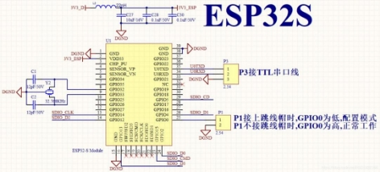
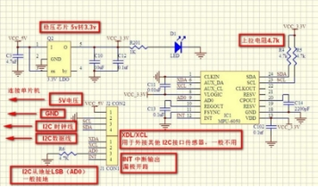
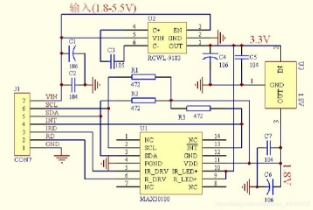
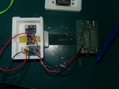
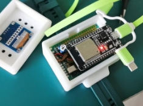
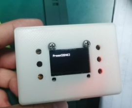

# 健康检测手环/手套
**一、项目的实施方案**

设计一个基于加速度传感器、陀螺仪、薄膜压力传感器、血氧传感器，开发可用于老龄化疾病(帕金森等)检测以及血氧饱和度等生理参数检测的系统。

设想1：老年人监测摔倒

当老年人遇到意外情况时,如果老年人质心位置—速度状态不在动态稳定区域以内(稳度为负)，老年人就会不稳定而失去平衡，对于老年人，下肢肌力衰退会导致下肢支撑力不够,不足以支撑起老年人在跌倒时导致的身体下降；同时由于老年人神经系统控制能力下降,神经传导减慢，动作反应时间延长,也会导致老年人在发生跌倒时不能及时的调整身体以保持平衡。

`	`老年人发生摔倒的过程中包括初始安全状态、失重状态、与低势物体或地面的撞击状态和倒后的平稳状态。其身体的三轴合加速度值定义为a=ax2+ay2+az2。在正常情况下，使用者的加速度值并不会有大的变化。但在失重状态和撞击状态，老年人的躯干三轴合加速度值a的变化很大。在日常生活中，人的上躯体部分的运动幅度较小，加速度变化不大，而在摔倒过程中，运动幅度变大，加速度变化很大。因此，三轴加速度传感器安装在老年人的上躯干部分。

设想2：帕金森监测

在出现帕金森之后，一些老年人的手脚会出现颤抖的情况，机械振荡是最简单导致震颤的原因，观察一个伸展的肢体如手，伸肌被激活去拮抗重力，而伸肌的激活又会导致拮抗它的屈肌激活，这样手部的肌纤维就会按照一个既定的频率被激活，因此手会依照一个既定的频率振荡，而这个频率在身体的不同部位是不同的，例如在手指是25Hz，手腕是6~8Hz，肘部是3~4Hz，而肩关节则是0.5~2Hz，这种频率会因为重量的加大而减低，或者紧张度的加大而增高。

用集成了三轴加速度计和陀螺仪的MPU-6050芯片采集手腕三轴加速度和角度，主要通过分析手腕三轴角度变化来判断穿戴者是否具有帕金森症状以及症状的严重程度。

设想3：血氧饱和度监测
`	`血氧饱和度是血液中被氧结合的氧合血红蛋白（HbO2）的容量占全部可结合的血红蛋白（Hb）容量的百分比，即血液中血氧的浓度，是呼吸循环的重要生理参数之一。如果血氧含量低，容易引发疲劳易困、精力不足、记忆力下降等状况，长期的血氧含量不足，还会对大脑、心脏等器官造成伤害。特别对于老年人，应每天监测血氧含量，一旦血氧低于警戒水平，需尽快补氧。
`	`测量时，需将血氧传感器紧贴皮肤。因为携带氧气的红血球能吸收较多红外光（850-1000mm），未携带氧气的红血球则是吸收较多的红光（600-750mm）。所以一般是通过测量双光束吸光度变化之比，一般选择入射光波长为660nm和940nm。运用Lambert-Bear定律并根据氧饱和度的定义可推出动脉血氧饱和度的近似公式为：Sa02=abQ。式中：Q为两种波长(Hb02、Hb)的吸光度变化之比a、b为常数，与仪器传感器结构、测量条件有关。 

**二、项目的核心器件**

**1.esp32开发板**

ESP-WROOM-32是一款通用型WiFi-BT-BLE MCU模组，功能强大，用途广泛。
`	`此款模组的核心是ESP32芯片，具有可扩展、自适应的特点。两个CPU核可以被单独控制或上电。时钟频率的调节范围为80MHz到240MHz。用户可以切断CPU的电源，利用低功耗协处理器来不断地监测外设的状态变化或某些模拟量是否超出阈值。ESP32还集成了丰富的外设，包括电容式触摸传感器、霍尔传感器、低噪声传感放大器，SD卡接口、以太网接口、高速SDIO／SPI、UART、I2S和I2C等。
`	`ESP-WROOM-32集成了传统蓝牙、低功耗蓝牙和Wi-Fi，具有广泛的用途：Wi-Fi支持极大范围的通信连接，也支持通过路由器直接连接互联网；而蓝牙可以让用户连接手机或者广播BLE Beacon以便于信号检测。ESP32芯片的睡眠电流小于5mA，使其适用于电池供电的可穿戴电子设备。ESP-WROOM-32支持的数据传输速率高达150Mbps，经过功率放大器后，输出功率可达到22dBm，可实现大范围的无线通信。因此，这款芯片拥有领先的技术规格，在高集成度、无线传输距离、功耗以及网络联通等方面性能佳。
`	`ESP32的操作系统是带有LWIP的freeRTOS，还内置了带有硬件加速功能的TLS1.2。芯片同时支持OTA加密升级。

esp32电路图

2. **MPU6050**

MPU-60X0是世界上第一款集成 6 轴MotionTracking设备。它集成了3轴MEMS陀螺仪，3轴MEMS加速度计，以及一个可扩展的数字运动处理器 DMP（ DigitalMotion Processor），可用I2C接口连接一个第三方的数字传感器，比如磁力计。扩展之后就可以通过其 I2C或SPI接口输出一个9轴的信号（ SPI接口仅在MPU-6000可用）。 MPU-60X0也可以通过其I2C接口连接非惯性的数字传感器，比如压力传感器。
`	`MPU-60X0对陀螺仪和加速度计分别用了三个16位的ADC，将其测量的模拟量转化为可输出的数字量。为了精确跟踪快速和慢速的运动，传感器的测量范围都是用户可控的，陀螺仪可测范围为±250， ±500， ±1000， ±2000°/秒（ dps），加速度计可测范围为±2， ±4，±8， ±16g。
`	`MPU6050是一个比较常见的“陀螺仪”，实际上它不仅包含三轴陀螺仪，还包含了三轴加速度计。MPU6050是一个典型的MEMS，将六轴的东西集成到了大概3mm×3mm×1.5mm的体积之中，因此在飞控中得到广泛应用。

MPU6050使用I2C进行通信。I2C使用两条线SCL、SDA进行通信，再加上供电的两条线，使用MPU6050仅需要电源、GND、SCL、SDA即可。

其他引脚:

· XCL、XDA,一般是接其他I2C器件，如磁力计等，然后通过编程，可以让MPU6050帮你读取磁力计的数据，再一起读回单片机。

·IRQ，中断引脚，可以编程设定当数据准备好时，该引脚有电平变化，触发单片机的外部中断。

MPU6050电路图

**3.MAX30100**

MAX30100是一款集成有脉搏血氧仪和心率监测传感器的模块。该器件集成有两个LED、一个光电探测器，经过优化的光学器件和低噪声模拟信号处理器，可检测脉搏血氧及心率信号。MAX30100采用1.8V和3.3V的电源电压。可通过软件来关断电源，待机模式下的电流消耗量可忽略不计，因而可以始终保持电源连接。并且MAX30100采用I2C通信方式。

采集过程：RED和IR照射然后使用ADC进行数据采集，采集后的AD值经过数字滤波器进入数据寄存器，然后使用IIC进行数据采集，在转换AD值时，也可以采集温度值。

MAX30100电路图

**三、项目的制作过程**

考虑到手背血管相对贴近皮肤，有利于血氧传感器的监测，并且对于老年人手部帕金森震颤的监测更为容易，而若监测器件便于拆解，则可以让老人在出门时携带该器件以便监测老人在外是否摔倒，并在摔倒情况发生后尽快通知监护人，同时警示周围人群。

为了将上述方案融入一个检测系统中，且适合老人使用，我们决定制作一个可拆解的可穿戴式手部护具。

我们先进行硬件模块的设计与制作。为了实现我们预想的功能，我们首先选择并购置了相应的传感器；选用MPU6050收集使用者手部发生帕金森震颤时的三轴加速度和角度数据；用MAX30100检测使用者的血氧饱和度和体温；用薄膜压力传感器试图检测使用者手部挥动时对护具产生的压力，并与所测的三轴加速度和角度结合分析使用者是否摔倒。

一开始我们使用stm32进行环境开发，但由于需要与各模块相连接且需要将检测的数据传输到上位机，我们碰到了一些较难解决的问题，最后决定使用esp32开发环境。esp32开发板集成了蓝牙和WIFI传输数据的功能，简化了一些繁琐的配置步骤。理论上需要3.3V的电压供电，驱动各模块正常运行，但esp32自带前置降压，我们额外增加了一个升压模块将电源电压升高，再由esp32自己降到3.3V为各模块供电。

选择好各种传感器与开发板后，接下来就是将它们组装起来。利用I2C总线将各个模块与esp32进行连接。在实际焊接前，我们先在洞洞板上将各模块连接起来进行测试，得到了较为理想的结果。由于不会制作PCB板，在实际焊接过程中只能使用跳线将各模块进行连接。然而我们发现在实际焊接中并不能得到所预想的检测结果。经过检查发现是因为各模块是用导线进行连接的，导线较长对I2C会有较大的干扰。最终我们将导线剪短并加上了相应的上拉电阻，解决了此问题，成功将开发板与各模块相连。

硬件各模块连接图

内部电路基本制作完成后，我们还需要设计一个外壳。起初，我们打算制作一个具有检测功能的手套，手腕部安装显示屏和血氧传感器，其余电路安置在手套的手背位置，仔细考虑一番觉得这样的设计不具有美观性且不切实际，最关键的是电路手背部分电路容易损坏，最终决定将所有电路全部装载在一个3D打印的外壳中，尽管这样的设计使成品看起来有一点笨重，但一体化设计使其具有很大的灵活性，不仅可以与各种模具结合以手表、护手等形式使用，也可以拆卸下来随身携带。

软件部分，我们起初打算采集到一个数据便将它传送至上位机处理，但由于我们之前将几个模块都连接在了I2C总线上，I2C是低速线，无法做到数据快速采集并传输。所以我们改为一帧里几个传感器同时采集数据，采集完将数据一起传输到上位机，但要提高采样率，保证较快的数据传输速度。处理采集到的数据时，我们使用了MATLAB，该软件运行处理较为缓慢，对我们项目正常的实施过程有一定的影响。

4. **项目的结果分析**

1.硬件电路板部分

       

2.最终成品分三段发送由三个模块采集的数据，每段128帧，第一段是由MPU6050采集的三轴加速度，使用卡尔曼计算姿态角，第二段使用MAX30100采集并计算血氧数据，第三段使用压力传感器采集施加至其上的压力，最后通过蓝牙将三段数据依次发送至上位机。

![1}4]48WX{49F(1C~1GFFUGF](pic/Aspose.Words.9fab1d28-b4d0-4341-814d-d2d018861474.007.jpeg)

![5YYLY@]YP\_B7X8CJ}GT56LF](pic/Aspose.Words.9fab1d28-b4d0-4341-814d-d2d018861474.008.jpeg)   

3.当UI界面开始运行，点击开始检测，上位机程序会开放蓝牙接口并开始接收由硬件采集到的数据，并通过对采集到的数据进行分析，尽可能达到我们的设计目标。首先，当数据传输至上位机后对其进行分段处理，通过检测第一段采集到的加速度信号的过零率来分析佩戴者手部的震颤程度，以判断佩戴者手部是否出现类似帕金森的症状，并在界面右侧的静态文本框中显示“有帕金森吗小老弟”。通过对第二段采集到的血氧信号进行处理，得到佩戴者的血氧饱和度并对其频谱进行分析并显示至右侧上方两个坐标区中，同时，如果佩戴者的血氧不在阈值范围内，则判断佩戴者未正确佩戴手环，并显示在界面右侧第二个静态文本框中。对采集到的第三段压力数据进行处理并显示其频谱数据。

4. **总结与展望**

我们这次做出的成品总体来说还有许多不足之处，比如说预计的老人摔倒警报功能，由于我们的设计中是分三段采集和发送数据，而老人的摔倒是一个短时过程，可能老人摔倒时设备正好没有在监测老人的运动姿态，导致数据没有能够及时记录和传输，无法报警；同时我们还有能够计算温度的模块，但由于所需测定时间过长且干扰严重从而删除了该功能。

对于血氧数据的降噪技术也是一个难点，采集到的血氧数据没有得到很好的降噪，只能在比较严苛的操作情况下能看到有规律的qrs波尖峰上部图像，无法准确的计算心率。压力传感器的敏感度也偏低，没有达到预想的效果。

但是，从目前已实现的效果来看，它成功的发挥了一个帕金森手部震颤监测器的效果，且能够大致地测定使用者常态下的血氧饱和度，便携程度也达到了预想的标准，是一款兼具了巨大开发潜力和实用性为一身的作品。

在此基础上，我们对其更多功能的综合与优化也有其设想，例如：老年人可能出现记忆力降低或者患有老年痴呆的疾病，会有走失的风险。我们之后也可以在穿戴式设备上增加GPS实时定位的技术，随时了解老年人所在的位置。老年人身体机能下降，容易摔倒或突发某些疾病，出现上述情况时，不光通过警报通知周围人群，家属也可以及时定位到老人的所在位置。在表带附近增设血压监测传感器，及时发现老人的血压变动，提醒老人或其监护人及时服药或就医。

我们相信，如果能够继续优化开发，解决目前已发现的种种难题，那么，这将是一个兼具低成本、低使用要求、高效且实用的老年人监护辅助设备。	

**六、参考文献**

[1] 王亚宾,张小栋,穆小奇,韩焕杰.用于助老伴行机器人的老年人摔倒预测方法研究[J].电子测量与仪器学报,2018,32(07):1-7.

[2] Castiglia S F, Tatarelli A, Ranavolo A, et al. Ability of a set of trunk acceleration-derived 

gait stability indexes to identify gait unbalance and recurrent fallers in subjects with Parkinson's 

disease[J]. Journal of the Neurological Sciences, 2021, 429.

[3] 吴小玲,蔡桂艳.可穿戴式血氧传感器的设计和定标方法研究[J].生物医学工程学杂志,2009,26(04):731-734+738.

[4] 周一峰,刘超英,黄虎,郭一鸣,邹林方.基于光电容积脉搏波描记法的反射型PPG信号传感器的设计[J].电子世界,2016(12):161.

[5]       Zhou C, Yang L, Liao H, et al. Ankle foot motion recognition based on wireless wearable 

sEMG and acceleration sensors for smart AFO[J]. Sensors and Actuators A: Physical, 2021, 331: 113025.

[6] 吴天昊. 基于3轴加速度传感器及陀螺仪的老年人摔倒识别[D].北京工业大学,2013.

[7] Zhang Xiaodong,Wang Yunxia,Wei Xiaojuan.Research on control technology of elderly-assistant & walking-assistant robot based on tactile-slip sensation[J].Engineering Sciences,2013,11(01):89-96.

5

